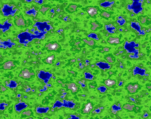
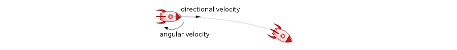
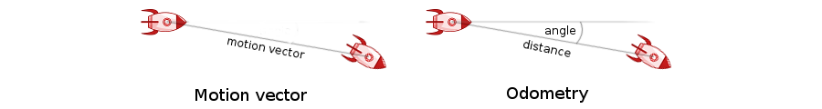
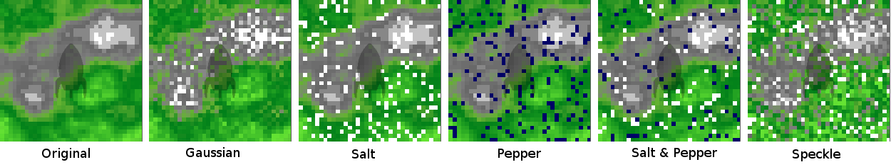
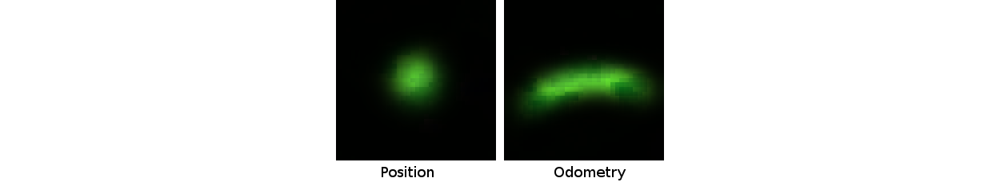

# Introduction

Monte Carlo localization is a method common in mobile robotics that enables a robot to estimate its location within a known environment using a recursive Bayesian estimation approach.
The robot is equipped with different sensors to sense and observe the environment as it moves around.
Using a given map, it then uses the observations to sequentically infer its location within that map.

In Bayesian terms, the recursive Bayesian estimation (or Bayesian filter) is a general method to estimate an unknown probability density function over time by incorporating new observation through an observation and a processing model.
The probability density function represents the belief over the states of a dynamic system and can therefore be seen a a filtering process to eliminate less probable states and eventually estimate the true underlying state.
The computation of the posterior distribution is often untractable due to the complexity of the observation model and the dynamically changing state and is therefore often approximated by grid-based or particle-based Monte Carlo methods.

In this project, we developed an demonstration application that shows the mechanism behind the recursive Bayesian estimation for grid- and particle-based Monte Carlo methods in a localization scenario.
In this simulation, we send a autonomous robot or spacecraft to a remote area or planet which topological map is known beforehand.
The spacecraft is equipped with a vision sensor observing the height of the terrain nearby, and a motion sensor measuring the motion of the spacecraft.
Using these noisy observations, the task is to estimate our location with respect to the given topological map.


# Problem statement

The goal of the Monte Carlo localization is to estimate the state of the spacecraft - in this particular case, we are interested only in the location $(x,y)$ on the topological map $\mathcal{M}$ with size $(x_{max}, y_{max})$.
The state space $\Omega$ can be represented by all possible states

\begin{equation}
\theta = (x,y) \in \Omega \quad \text{ with } 0 < x < x_{max} \text{ and } 0 < y < y_{max} \nonumber
\end{equation}

## Test

and our goal is to find a good estimate $\hat{\theta_t}$ of the real state $\theta_t$ at time t.
We can formulate the belief $Bel(\theta_t)$ of possible states at a time $t$ given the independent observations $z_{0:t}$ and motions $u_{0:t}$ (note that we do not explicitly state the conditioning on $u_{0:t}$ for readability) in a probabilistic manner as

\begin{equation}
Bel(\theta_{t}) = p(\theta_t | z_{0:t})
                = \frac{p(z_t | \theta_t) \ p(\theta_t | z_{0:t-1})}{p(z_t | z_{0:t-1})}
\end{equation}

with the normalization term

\begin{equation}
p(z_t | z_{0:t-1}) = \int p(z_t | \theta_t) \ p(\theta_t | z_{0:t-1}) d\theta_t
\end{equation}

and the predictive distribution

\begin{equation}
p(\theta_t | z_{0:t-1}) = \int p(\theta_t | \theta_{t-1}) \ p(\theta_{t-1} | z_{0:t-1} ) \quad.
\end{equation}

The system can be fullydetermined by defining the **observation model**
$p(z_t | \theta_t) = p(z_t | \theta_t, \mathcal{M})$
to compute the likelihood of the observation $z_t$ at location $\theta_t$ given the map model $\mathcal{M}$, and the **motion model** given by the transition distribution
$p(\theta_t | \theta_{t-1}) = p(\theta_t | \theta_{t-1}, u_t)$
given the last estimated location $\theta_{t-1}$ and the observed motion $u_t$.

However, the integrals of the normalization term and the predictive distribution cannot be determined analytically and have to be solved using the Monte Carlo integration method.
With the Monte Carlo representation of the posterior distribution, we are able to estimate the true state of the spacecraft with respect to any criterion.
Typical estimates are the Minimum Mean Square Estimate (or the expectated value)

\begin{equation}
\hat{\theta}_t^{\scriptscriptstyle{\text{MMS}}} = E[\theta_t | z_{0:t}] = \int \theta_t p(\theta_t | z_{0:t}) d\theta_t
\end{equation}

or the Maximum A-Posteriori estimate (or the maximum mode)

\begin{equation}
\hat{\theta}_t^{\scriptscriptstyle{\text{MAP}}} = \text{arg}\max_{\theta_t}(\theta_t | z_{0:t})
\end{equation}


# Derivation of sequential Bayes filter

We shall in this section derive and formulate the *Recursive Bayesian Estimation* or Bayes Filter. The purpose is to lay the foundation for the application known as particle filtering. Specifically, we will use the *Sequential Importance Resampling* (SIR). Of those algorithms associated with SIR we utilize the special case known as *Bootstrap filter*.

## Bayesian Network of The Hidden Markov Model (HMM)

Using HMM and denoting a time-step as $k$, we will infer the probability of a current true state, denoted $x_k$, conditioned on all previous hidden and (including the current) observed  states, which we denote $x_{1:k-1}$ and $z_{1:k}$ respectively. For HMM, we make the following assumption about any time sequence:

\begin{eqnarray}
p(x_k|x_{1:k-1}) &= p(x_k|x_{k-1})\\
p(z_k|x_{1:k}) &= p(z_k|x_k).
\end{eqnarray}

We further assume, that given the current state, the current observation will be independent of all previous observations,

\begin{equation}
p(z_{1:k}|x_k) = p(z_k|x_k)p(z_{1:k-1} |x_k).
\end{equation}

For completion, we can then write the entire joint probability for a time sequence as follows,

\begin{equation}
p(x_{1:k},z_{1:k}) = p(x_1) \prod_{i=2}^k p(z_i|x_i)p(x_i|x_{i-1}).
\end{equation}

However, for predictive purposes, we wish to find the distribution of the current state $x_k$ conditioned on all previous states. Since we assume any hidden state is independent of all previous hidden states, except the immediate previous one, we whish to infer,

\begin{equation}
p(x_k|z_{1:k}) = \frac{p(z_{1:k}|x_k)p(x_k)}{p(z_{1:k})}=\frac{p(z_k|x_k)p(z_{1:k-1} |x_k)p(x_k)}{p(z_{1:k})}=\frac{p(z_k|x_k)p(x_k|z_{1:k-1} )p(z_{1:k-1} )}{p(z_{1:k})}=\frac{p(z_k|x_k)p(x_k|z_{1:k-1} )}{p(z_{k}|z_{1:k-1} )}.
\end{equation}

As we shall see later, we explicitly model $p(z_k|x_k)$, thus leaving us to reformulate $p(x_k|z_{1:k-1} )$ as a marginalization,

\begin{equation}
    p(x_k|z_{1:k-1} ) = \int \frac{p(x_k,x_{k-1},z_{1:k-1} )}{p(z_{1:k})}dx_{k-1} = \int \frac{p(x_k|x_{k-1})p(z_{1:k-1} | x_{k-1} ) p(x_{k-1})}{p(z_{1:k})}dx_{k-1} =\int p(x_k|x_{k-1})p( x_{k-1} | z_{1:k-1})dx_{k-1},
\end{equation}
where we further utilized the following assumption $p(x_k,z_{1:k-1}|x_{k-1}) = p(x_k|x_{k-1})p(z_{1:k-1} | x_{k-1} )$.

We, then identify the previous equation as an average of $p(x_k|x_{k-1})$ over the conditional probability density of $x_{k-1}$. Thus, referring to Chap. 10 (*A. Gelman, J. Carlin, H. Stern, D. Dunson, A. Vehtari, and D. Rubin, Bayesian
Data Analysis, Third Edition (Chapman & Hall/CRC Texts in Statistical Science)
(Chapman and Hall/CRC), 3rd edn. (2014).*), we can estimate said expected value through importance sampling, as sampling $x_{k-1}$ in it's current form is non-trivial. Hence, by denoting a proposal distribution as $\pi(\theta)$, where $\theta$ denotes all relevant parameters associated with the HMM model, we write,

\begin{equation}
p(x_k|z_{1:k-1} ) \simeq \sum_{s=1}^S p(x_k|x_{k-1}^s)\tilde{w(\theta)^s},
\end{equation}
where $\theta^s$ denotes all relevant paramters but explicitly a sample $x_{k-1}^s$, and
\begin{equation}
\tilde{w(\theta)}^s = \frac{w(\theta^s)}{\sum_{s=1}^S w(\theta^s)}, \quad \text{with} \quad w(\theta^s) = \frac{p( x_{k-1}^s | z_{1:k-1})}{\pi(\theta^s)}.
\end{equation}

It turns out that a proper choice of proposal distribution from which $x_{k-1}$ is easily sampled, significantly simplifies the posterior estimation, as we will now show,

\begin{equation}
    p(x_{k-1}|z_{1:k-1}) \propto p(z_{\alpha}|x_{\alpha})p(x_{\alpha}|z_{\alpha-1}) = \sum_{s=1}^Sp(z_\alpha|x_\alpha)p(x_\alpha|x_{\alpha-1}^s)\tilde{w_\alpha(\theta^s)},
\end{equation}

where $\alpha = k-1$ and any approximate equalities have been substituted with strict equalities for brevity. Using the above equation and dropping the parameter dependencies for the weights, we find,

\begin{equation}
w^s_k = \frac{p( x_{\alpha}^s | z_{1:\alpha})}{\pi(\theta^s)}\propto \frac{p(z_\alpha|x^s_\alpha)\sum_{l=1}^L p(x_\alpha^s|x_{\alpha-1}^l)\tilde{w_\alpha}^l}{\pi(\theta^s)}.
\end{equation}

Clearly, weights at subsequent time-steps depend sequentially on immediate previous weights. However, it would perhaps seem computationally disadvantageous to sample $S$ samples, for each we need to calculates probabilities through a sum of previous $L$ samples. To make further simplifications, we turn to particle filtering.

## Particle filters

Particle filters rely on the simple concept assigning each weight to a unique particle. We formulate this mathematically as the set of $S$ samples,

\begin{equation}
    \{x_k^s,\tilde{w_k}^s~|~s = 1,2,\dots,S\}.
\end{equation}

The fundamental idea is, that for each timestep we keep our samples/particles, but update their weights. We formualte this as,

\begin{equation}
    p(x_k^s|x_\alpha^l) = \begin{cases} p(x_k^s|x_\alpha^s) & s =l \\ 0 & \text{otherwise} \end{cases}.
\end{equation}

Consequently, we still draw samples, but the net effect is that each samples is simply updated, and one can kee track of each samples/particle's weigths development through a sequence. Armed, with the particle formulation, we simplify the weights update as follows,

\begin{equation}
w^s_k = \frac{p( x_{\alpha}^s | z_{1:\alpha})}{\pi(\theta^s)} \propto \frac{p(z_\alpha|x^s_\alpha) p(x_\alpha^s|x_{\alpha-1}^s)\tilde{w_{k-1}}^s}{\pi(\theta^s)}.
\end{equation}

By choosing $\pi(\theta^s) = p(x_\alpha^s|x_{\alpha-1}^s)$, we arrive at the bootstrap filter, and we each weight is thus updated as,

\begin{equation}
w^s_k =p(z_{k-1}|x^s_{k-1})\tilde{w_{k-1}}^s.
\end{equation}

This formulation completely allows us to ignore the exact form of the original distribution $p(x_{k-1}|z_{1:k-1})$, making the particle an intuitive sampling algorithm. We should note, that the particle filters are highly prone to include weights which negative influence the distribution. Thus, we keep track of the effective sample size - see Chap. 10 (*A. Gelman, J. Carlin, H. Stern, D. Dunson, A. Vehtari, and D. Rubin, Bayesian
Data Analysis, Third Edition (Chapman & Hall/CRC Texts in Statistical Science)
(Chapman and Hall/CRC), 3rd edn. (2014).*),

\begin{equation}
S_{eff} = \frac{1}{\sum_{s=1}^S(\tilde{w(\theta^s)})^2}.
\end{equation}

## Algorithmic implementation

We now provide the algorithmic steps, which allows to calculate and update said weights. Assume $p(z_k|x_k)$, $p(z_k|x^s_k)$ and $p(x_k|x_{k-1})$ are given, then at each time-step,

 * For $s = 1,2, \dots, S$ draw $x_k$,
     \begin{equation}
     x_k \sim p(x_k|x_{k-1}).
     \end{equation}
 * For $s = 1,2, \dots, S$ update weigths $w_k^s$,
     \begin{equation}
    w^s_k =p(z_{k-1}|x^s_{k-1})\tilde{w_{k-1}}^s.
    \end{equation}
 *  For $s = 1,2, \dots, S$ normalize the weights,
     \begin{equation}
     \tilde{w}_k^s = \frac{w_k^s}{\sum_{s=1}^S w_k^s}
     \end{equation}
 * Compute the effective sample size
     \begin{equation}
     S_{eff} = \frac{1}{\sum_{s=1}^S(\tilde{w(\theta^s)})^2}.
     \end{equation}
 * If $S_{eff} < S_{eff}^{threshold}$ perform resampling:
     * Choose a resampling method (we choose a stratisfied resampling strategy, as we will touch upon later).
     * Draw $S$ new particles/samples from the sample population according to their weigths $\tilde{w}_k^s$.
     * Reset all weights as $\tilde{w}_k^s = 1/S$.
 * Compute $p(x_k|z_{1:k-1} )$
     \begin{equation}
    p(x_k|z_{1:k-1} ) \simeq \sum_{s=1}^S p(x_k|x_{k-1}^s)\tilde{w(\theta)^s},
    \end{equation}
 * Compute $p(x_k|z_{1:k})$,
     \begin{equation}
        p(x_k|z_{1:k}) \propto p(z_k|x_k)p(x_k|z_{1:k-1} ).
    \end{equation}


# Simulation

In order to demonstrate the Monte Carlo localizatin method, a model of a real scenario has to be created in which the simulation takes place.
Therefore, we need to model

 * the environment given as a topolgical map
 * the spacecraft which is able to navigate around the map
 * the sensors used by the spacecraft to make observations


## World model

The world model is generated automatically and is represented by a height map, i.e. a rasterized image is used to represent the elevation at discrete positions.
The height values are created using a composition of perlin or simplex noise which is often used in computer graphics to create natural landscapes.
The height values are then mapped to colors for visual purpose only.
The world map is implemented in the file [World.py](http://github.com/Bjarne-AAU/MonteCarloLocalization/blob/master/World.py)




## Spacecraft model

The spacecraft is basically just a location which can be moved around manually using the arrow keys.
The motion is determined by its directional and angular velocity and an arbitrary friction value for each.
The spacecraft is implemented in the file [Robot.py](http://github.com/Bjarne-AAU/MonteCarloLocalization/blob/master/Robot.py)




## Sensor model

Sensors can be described by their observation method and their observation rate.
The observations made by the sensor underly an unknown noise model.
The abstract sensor and noise model are implemented in the file [Sensor.py](http://github.com/Bjarne-AAU/MonteCarloLocalization/blob/master/Sensor.py).

In our case, we simulate two kinds of sensors with different noise models:

 * Motion sensor: Captures motion of the spacecraft (Odometry/Position)
 * Vision sensor: Captures height of terrain beneath the spacecraft


### Motion Sensor

The motion sensor is used to capture the movement of the spacecraft since the last measurement and is basically just the motion vector between the last and current position.
The sensor is capable to make observations at a given framerate.
The implementation of the Motion sensor can be found in the file [Motion.py](http://github.com/Bjarne-AAU/MonteCarloLocalization/blob/master/Motion.py).

We simulate two different measurement models: (a) using the motion vector measurements or (b) using the odometry, i.e. independent measurement of the angle and distance of the motion.
This is reflected by the two noise models:

 * Vector: The motion error is given by a bivariate normal distribution
 * Odometry: The error for rotation and distance are both normal distributed, but considered independently



The implementation of the Motion sensor noise can also be found in the file [Motion.py](http://github.com/Bjarne-AAU/MonteCarloLocalization/blob/master/Motion.py).

### Vision Sensor

The vision sensor is able to capture the height of the terrain in its view.
The view is determined by the position of the spacecraft and is able to get information about the terrain within a certain range given by a rectangle with a predefined size.
The sensor is capable to make observations at a given framerate.
The implementation of the Vision sensor can be found in the file [Vision.py](http://github.com/Bjarne-AAU/MonteCarloLocalization/blob/master/Vision.py).

Additionally, we implemented various methods for simulating sensor noise:

 * Gaussian: Simple pixelwise Gaussian noise
 * Salt: Some pixels are changed to the maximum possible value
 * Pepper: Some pixels are changed to the minimum possible value
 * Salt & Pepper: Some pixels are changed randomly to the maximum or minimum possible value
 * Speckle: Additive Gaussian noise based on observed pixels



The implementation of the Vision sensor noise can also be found in the file [Vision.py](http://github.com/Bjarne-AAU/MonteCarloLocalization/blob/master/Vision.py).


# Motion model

Motion model is used to predict the new position of the density or particles depending on the commands given to the robot. We used two motion models, a naive one and an advanced one.

  * The naive model moves the density or particles based on the motion vector and adds Gaussian noise to this new position.

    ```python
      def naive(cls, motions, observation):
      probs = linalg.norm(motions - observation, axis=1)
      return np.exp(-probs)
    ```
  * The advanced model is an odometry-based model. Here, the density or particles are moved based on the rotation and translation of the robot. Then, it is added Gaussian noise to each of these parameters. This model is more accurate, as the robot can have either an error on distance traveled or on the directation that it was facing during the movement. This model follows this conditional probability density
  \begin{equation}
  p(x_t|x_{t_1}, u_t)
  \end{equation}
  where $x_t$ is the current position, $x_{t-1}$ is the previous position and $u_t$ are the parameters that affects the movement (rotation and translation).

    ```python
      def advanced(cls, motions, observation):
      probs = np.zeros(len(motions))

      mag = np.maximum(linalg.norm(observation), 0.001)
      mags = linalg.norm(motions, axis=1)
      indices = mags.nonzero()[0]

      probs += stats.norm.logpdf( mags/mag, 1, cls.level_dist/2.0)

      angles = np.ones(len(motions))
      angles[indices] = observation.dot(motions[indices,:].T) / (mags[indices] * mag)
      probs += stats.norm.logpdf(angles, 1, cls.level_rot*cls.level_rot/2.0)

      return np.exp(probs)
    ```




# Observation model

In the observation model it is calculated the likelihood of being in the center of a map patch $M$ based on the observation $Z$ from the vision sensor. This likelihood can be evaluated using four different methods:

 * Mean absolute difference. It is more suited for the particle-based method as it introduces more noise to the comparison. The mean produces a flatter distribution, which helps to avoid that positions with high similarities are not covered by particles.

 	$$ R(x,y)= \sum_{x',y'} |Z(x',y')-M(x+x',y+y')| $$

    Implementation:
    ```python
    def ObservationMDIFF(cls, location, world, observation):
        pos = tuple(location)
        observation_mean = np.mean(observation)
        return -np.abs(world[pos] - observation_mean)
    ```

 * Normalized cross-correlation coefficient. It is better suited for the grid-based method as it finds positions with high similarity.

    $$ \begin{array}{l} Z'(x',y')=Z(x',y') - 1/(w \cdot h) \cdot \sum _{x'',y''} Z(x'',y'') \\ M'(x+x',y+y')=M(x+x',y+y') - 1/(w \cdot h) \cdot \sum _{x'',y''} M(x+x'',y+y'') \end{array} $$

 	$$ R(x,y)= \frac{\sum_{x',y'} (Z(x',y') \cdot M(x+x',y+y'))}{\sqrt{\sum_{x',y'}Z(x',y')^2 \cdot \sum_{x',y'} M(x+x',y+y')^2}} $$

    Implementation:
    ```python
    def ObservationCCOEFF(cls, location, world, observation):
        model = cls._extract_location(location, observation.shape, world)
        norm = np.sqrt(np.sum(model*model) * np.sum(observation*observation))
        return np.sum( (model - np.mean(model)) * (observation - np.mean(observation)) ) / norm
    ```
 * Normalized cross-correlation. Similar to the previous method. The main difference is that is not normalized, so it will perform worse when dealing with large values.

 	$$ R(x,y)= \frac{ \sum_{x',y'} (Z'(x',y') \cdot M'(x+x',y+y')) }{ \sqrt{\sum_{x',y'}Z'(x',y')^2 \cdot \sum_{x',y'} M'(x+x',y+y')^2} } $$

    Implementation:
    ```python
    def ObservationCCORR(cls, location, world, observation):
        model = cls._extract_location(location, observation.shape, world)
        norm = np.sqrt(np.sum(model*model) * np.sum(observation*observation))
        return np.sum( model * observation ) / norm
    ```

 * Mean squared difference. It is a good compromise in performance for the grid-based and particle-based method.

 	$$ R(x,y)= \sum_{x',y'} (Z(x',y')-M(x+x',y+y'))^2 $$

    Implementation:
    ```python
    def ObservationSQDIFF(cls, location, world, observation):
        model = cls._extract_location(location, observation.shape, world)
        diff = observation - model
        return -np.sum(diff*diff)
    ```


# Respresentations

We approximate the probability distribution (eq. XX) using two methods: grid-based method and particle filter. In grid-based localization (assuming the robot is stationary) the probabilities of all the coordinates in the grid are evaluated. Thus, the robot's belief of its location in the environment is represented by those probabilities. Because all the grid coordinates are evaluated, the grid-based method has less tractable computational properties. That is, the memory requirements and computational time scales with the size and resolution of the environment considered. In our case, we represent the environment as a 2-dimensional x,y coordinate map plus the altitude (i.e. distance between robot and map's surface).

With the particle-filter, the robot's belief is evaluated from randomized weighted samples of its environment (i.e. particles). Therefore, the computational load is more tractable compared to the grid-based method as it scales linearly with the amount of particles employed. However, this comes with the trade-off of less accurate approximations compared to the grid-based method.

PROPAGATING DENSITIES PART GOES HERE: In essence, the difference between these two methods during the recursive steps can be thought of as in one the probability densities are propagated from the previous state to the current state (grid-based), whereas in the other the pdf is ... (I don't know what I'm talking about...lol)


## Resampling Methods

We implement three different sampling methods for the robot localization problem: naive sampling, stratified sampling, and systematic sampling. Ideally, the goal of the resampling method should be to sample those particles that are representative of our unknown probability distribution (eq. XX, the probability of the robot's location). In other words, to filter out unlikely particles and choose those with a highr probability (higher weights). However, sampling randomly can result in systematically picking more low weight particles and discarding large weight particles, and can therefore not only result in an unrepresentative sample, but it can also gradually lead to degeneracy as the sampling sequence continues. We employ these resampling methods to combat degeneracy (i.e. to not discard highly weighted particles during the resampling phase). We briefly expose the three methods and their properties. All three methods share the same initial structure in the sense that we first compute a normalized cumulative sum of the weights and then we sample with replacement from it. The following function implements the normalized cumulative sum and the draws from it with the index supplied by the implemented resampling method.

```python
def _resample_indices(self, positions):
        indices = np.searchsorted(np.cumsum(self._density), positions, side='right')
        self._locations = self._locations[indices]
        self._density = self._density[indices]
        self._density /= np.sum(self._density)
```

### Naive Sampling

In naive sampling, we simply draw uniformly from this cumulative sum of the weights. We implement this in python by cross-referencing two arrays: one array which stores N uniform draws, and another storing the cumulative sum of the weights (see function above). We then use the index of the drawn particles from the cumulative sum array as the basis of our new sample distribution. In this manner, particles with larger weights are more likely to be drawn, and hence we prevent the problem of picking unrepresentative particles.

```python
def resample_naive(self):
        positions = np.random.random(self.N)
        self._resample_indices(positions)
```

### Stratified Sampling

Similar to naive sampling, we compute the cumulative sum of the weights and normalize it. However, it differs from it in that we divide our sampling space into N equal groups (i.e. the stratification), then we draw uniformly from each group. This results in drawing the same amount of times from each subdivision, and hence we ensure that we sample more evenly across the sampling space.

```python
def resample_stratified(self):
        positions = (np.arange(self.N) + np.random.random(self.N)) / self.N
        self._resample_indices(positions)
```

However, this introduces a new problem - sample impoverishment - whereby with each iteration our sample becomes more and more highly concentrated with particles originating from large weight particles. That is, since large weight particles are more likely to be drawn, it can be seen that with each resampling step, we gradually reduce the diversity of the particles. In a worst case scenario (in the limit) of sample impoverishement, we would end up with a sample whose particles originated from one particle of large weight, which would result in (poorly) approximating our probability distribution (eq. XX) with only one point estimate. We combat this by resampling only when the effective sample size (N_eff is set to 0.5 here) threshold is reached.  In this manner, we slow down the process of sample impoverishement.


### Systematic Sampling

Similar to stratified sampling, we divide the sampling space into N equal groups, except that instead of each group's draw being independent of eachother, in systematic sampling the position of a draw is the same in each group. Therefore, the draws in each group are equally spaced.

```python
def resample_systematic(self):
        positions = (np.arange(self.N) + np.random.random()) / self.N
        self._resample_indices(positions)
```
